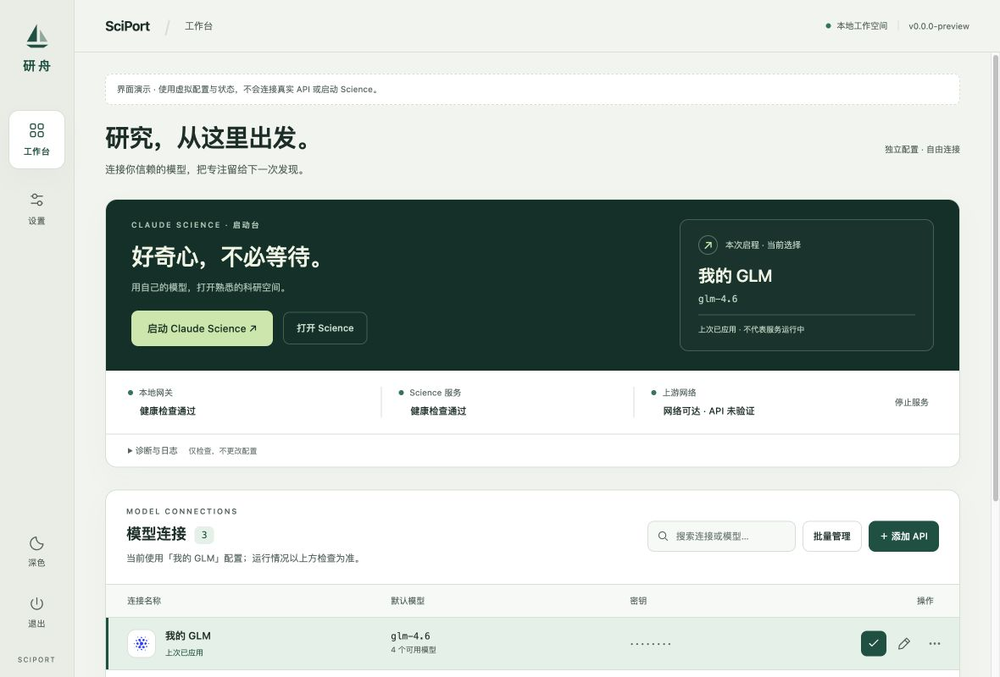
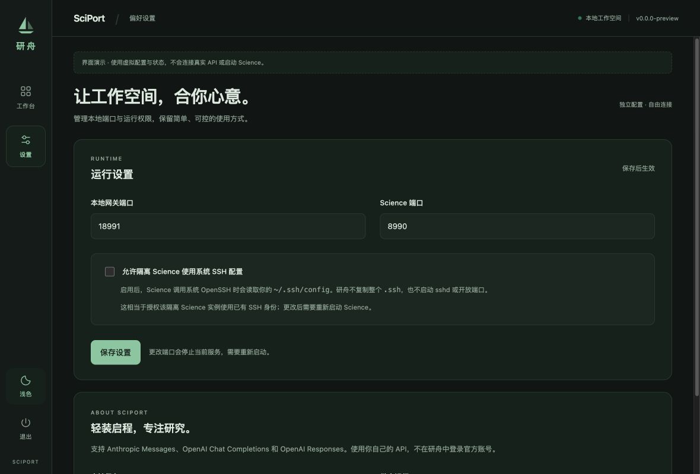

<div align="center">

# SciPort · 研舟

**Your model API. A familiar research workspace.**

[中文](README.md) · [English](README.en.md)

[Download v0.9.0](https://github.com/Vonfre/claude-science-api/releases/tag/v0.9.0) · [Report an issue](https://github.com/Vonfre/claude-science-api/issues) · [Documentation](docs/README.md)

</div>

SciPort is a local API connection manager and launcher for Claude Science. This release focuses on third-party model APIs: manage connections, choose models, launch an isolated Science workspace, and inspect local service status. It does not include Claude Science itself and is not an official Anthropic product.



*Screenshots use simulated data to demonstrate the interface; they are not evidence of live connectivity.*

## Features

- **One launch workspace:** start, open, and stop Science; see the selected connection and pending changes.
- **Multiple model connections:** search profiles, edit model assignments, and batch-delete profiles or clear saved keys.
- **Compatible API protocols:** Anthropic Messages, OpenAI Chat Completions, and OpenAI Responses. Each provider's actual compatibility still requires verification.
- **Exact model IDs:** a default model is required; quality, fast, and Fable assignments are optional and inherit the default when left blank.
- **Honest status reporting:** Gateway health, Science health, and upstream network reachability are separate. A reachable network does not prove a valid API key.
- **A simpler interface:** workbench and settings, light/dark themes, and collapsible diagnostics and logs.

## Download and install

This release provides a **macOS Apple Silicon (M-series, arm64)** package. Intel Mac, Windows, and Linux packages are not provided or validated.

1. Download `SciPort_0.9.0_aarch64.dmg` from the [v0.9.0 Release](https://github.com/Vonfre/claude-science-api/releases/tag/v0.9.0).
2. Install Claude Science through its official distribution channel first. SciPort does not bundle, download, or automatically update Science.
3. Open the DMG and drag **SciPort.app** into Applications.
4. Open SciPort and add an API connection.

**Signing:** this build uses local ad-hoc signing, not Apple Developer ID signing or Apple notarization. macOS may block the first launch. Verify the download source and the Release SHA-256 first; if you trust the build, use the opening options supplied by macOS under Privacy & Security. Do not disable system-wide security protections.

### Upgrading from CSSwitch

Quit CSSwitch before upgrading; do not run both apps with the same application identifier simultaneously. The new application filename is `SciPort.app`, while the application identifier and `~/.csswitch` configuration directory remain compatible. Renaming the app does not automatically migrate or clear configuration. You may keep an offline backup of the old app for rollback.

Only API features are exposed in this release. Removing account or extension UI does not automatically delete legacy data. Disable any previously installed Science translation browser extension manually. To roll back, quit SciPort and restore your old app backup; do not manually change configuration without backing it up first.

## Connect your first API

The application UI is currently in Chinese; this English README explains the workflow.

1. Click **添加 API (Add API)** and choose a provider or custom protocol.
2. Enter a name, API base URL, an exact model ID from your provider, and your API key.
3. Click **创建 (Create)**, then **设为当前 (Set as current)** for the connection.
4. Click **启动 Claude Science (Start Claude Science)**. Selecting a row alone does not interrupt an existing session; changes are applied when starting.
5. Check Gateway and Science health. Expand **诊断与日志 (Diagnostics and logs)** if needed.

Never paste API keys, full configuration files, or private logs into public issues. Use model IDs actually provided by your supplier; a template recommendation does not guarantee account access.

## Official directory connector errors

Science may display:

> Directory connectors unavailable
>
> Your claude.ai session has expired. Sign in again to restore your directory connectors.

**This release does not claim to fix that error.** Third-party model connectivity and an official claude.ai session are separate authorization paths. SciPort does not provide official account sign-in, synchronize browser cookies, or fabricate connector authorization. Working model calls do not imply working official directory connectors. Use the official sign-in and connector workflow when you need official account capabilities.

This release also removes Science translation controls, Codex account sign-in entry points, official-mode switching, and Skill/MCP management UI. Removing Chinese-language switching refers to the Science translation feature; SciPort's own interface remains Chinese.

## Local data and permissions

- API keys are stored locally in `~/.csswitch/config.json` with `0600` permissions. **This is not encrypted Keychain storage.** Software running with the same user's permissions may still read the file.
- Third-party Science uses isolated runtime directories. Reading official account credentials is not part of SciPort's API configuration workflow.
- The local Gateway uses loopback networking. Ports are configurable; `8765` is reserved for official Science, and the two custom ports must differ.
- System SSH reuse is off by default. Enabling it authorizes isolated Science to use existing SSH configuration and identities. SciPort does not copy the entire `.ssh` directory or start an SSH server.
- Deleting connection profiles does not delete Science projects. Clearing saved keys requires entering them again before those connections can be used.



## Build from source

Requirements: macOS, Xcode Command Line Tools, Node.js/npm, and a Rust toolchain with an Apple Silicon target.

```bash
git clone https://github.com/Vonfre/claude-science-api.git
cd claude-science-api
git checkout v0.9.0
npm ci --prefix desktop
npm run tauri --prefix desktop -- build --bundles app
```

Output: `desktop/src-tauri/target/release/bundle/macos/SciPort.app`. The build compiles its Gateway sidecar from the same source. Do not substitute an old sidecar binary.

Development mode:

```bash
npm run tauri --prefix desktop -- dev
```

Focused frontend checks:

```bash
bash test/run-frontend.sh
```

See [testing](docs/operations/testing.md) for the full source gate and isolation requirements. Source tests, package validation, real Science behavior, real-provider calls, and Apple notarization are separate evidence layers. **This release does not claim that every provider, official connector, or research workflow has passed live testing.**

## Documentation and feedback

- [UI and feature contract](docs/features/ui-information-architecture.md)
- [Development](docs/operations/development.md)
- [Release process](docs/operations/release.md)
- [Changelog](CHANGELOG.md)
- [Report an issue](https://github.com/Vonfre/claude-science-api/issues) with the version, macOS/chip details, reproduction steps, and redacted errors.

Most internal engineering documentation is currently in Chinese.

## Credits and licensing

SciPort is derived from [CSSwitch](https://github.com/SuperJJ007/CSswitch). Its upstream copyright notice and [MIT license](LICENSE.upstream) are retained. This repository's existing [Apache-2.0 license](LICENSE) is also retained; new contributions use the repository license, while upstream code retains its MIT license and attribution. See [NOTICE](NOTICE). Claude and Anthropic names belong to their respective owners. This project is not affiliated with or endorsed by Anthropic.
